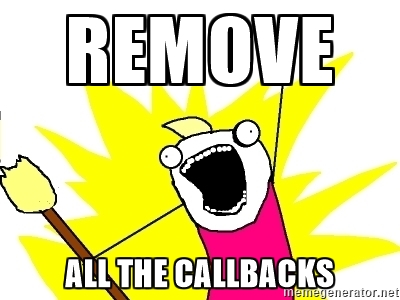

# Intro

---

### What Is Koa?

* it is a nodejs web framework
* it uses generators/asnyc+await
* designed by the team behind express

---

### Who Am I?

- Erik Söhnel
- Javascript Dev at Lovoo
- We use Koa in *production*

---

### Setup

`npm install --save koa`

---

### Hello World

```javascript
import Koa from 'koa';

const app = new Koa();

app.use(function * () {
    this.body = 'hello dresdenjs';
});

app.listen(3000);
```

---

### Hello World, Asnychronous

```javascript
import Koa from 'koa';
import request from 'request-promise-json';

const app = new Koa();

app.use(function * () { /* ... */ });

app.listen(3000);
```

Note:
* biggest selling point

---

### Hello World, Asnychronous

```javascript
// respond with the hackernews topstory
app.use(function * () {
    const url = 'https://hacker-news.firebaseio.com/v0';
    const id = yield request.get(`${url}/topstories.json`))[0];
    const story = yield request.get(`${url}/item/${id}.json`);

    this.body = `<h1>topstory: ${story.title}</h1>`;
});
```

Note:
* this is the main reason we chose Koa
* we don't have any callback code in our nodejs project

---

 <!-- .element: style="transform: scale(2)" -->

Note:
* I would have had a hard time without yield
* but there is more ...

---

# features

---

### Simple Request Handlers

* koa wraps nodes req and res objects
* all is done on the context object (`this` or `ctx`)
* request: `get()`, `cookies.get()`, `query`, `params`
* response: `body`, `status`, `set()` for headers, `redirect()` and many more
* [documentation](https://github.com/koajs/koa/blob/master/docs/api/context.md) is a bit hard to find

---

### Simple Request Handlers

```javascript
app.use(function * () {
    this.status = 202;
    this.body = {
        json: 'response',
        query: this.query,
        headers: this.headers
    };
});
```

---

### Easy To Use Middlewares

* used in express and other web frameworks
* add behavior *around* request handlers
* generators + middlewares -> win win win

Note:
* express design team

---

### Easy To Use Middlewares

```javascript
app.use(function * (next) {
    console.log('before');

    yield next; // <--- pass control to other middleware

    console.log('after');
});
```

---

### Passing Control

```javascript
app.use(function * outer (next) {
    console.log('outer before');
    yield next;
    console.log('outer after')
});

app.use(function * inner (next) {
    console.log('inner before');
    yield next;
    console.log('inner after')
});

app.use(function * handler () {
    console.log('handler')
});
```

<span class="fragment current-visible" data-code-focus="1"></span>
<span class="fragment current-visible" data-code-focus="2"></span>
<span class="fragment current-visible" data-code-focus="3"></span>
<span class="fragment current-visible" data-code-focus="7"></span>
<span class="fragment current-visible" data-code-focus="8"></span>
<span class="fragment current-visible" data-code-focus="9"></span>
<span class="fragment current-visible" data-code-focus="13"></span>
<span class="fragment current-visible" data-code-focus="14"></span>
<span class="fragment current-visible" data-code-focus="15"></span>
<span class="fragment current-visible" data-code-focus="10"></span>
<span class="fragment current-visible" data-code-focus="11"></span>
<span class="fragment current-visible" data-code-focus="4"></span>
<span class="fragment current-visible" data-code-focus="5"></span>
<span class="fragment current-visible" data-code-focus=""></span>

Note:
* how are middlewares executed

---

### Middleware: logging

```javascript
app.use(function * (next) {
    console.log(`${this.method} ${this.url}`);

    yield next; // <--- pass control to other middleware
});
```

---

### Middleware: error handling

```javascript
app.use(function * (next) {
    try {
        yield next;
    } catch (e) {
        const msg = `Error on ${this.method} ${this.url}:`;
        console.error(msg, error.stack);

        this.status = 500;
        this.body = 'Internal Server Error';
    }
});
```

Note:
* readable javascript
* we use exactly that pattern in practice (except for nicer error formatting)

---

### Middleware Library: Sessions

```javascript
import session from 'koa-session-store';

app.keys = ['random secret'];

app.use(session()); // session is a middleware
```

Note:
* additional functionality is often provided through middlewares: csrf token protection, caching
* no prepackaged middleware for koa
* easy composition

---

### Middleware Library: Routing

```javascript
    import KoaRouter from 'koa-router';

    const router = new KoaRouter();

    app.use(router); // the router is a middleware

    router.get('/hello', function *() {
        this.body = 'Hello World!';
    });
```

---
